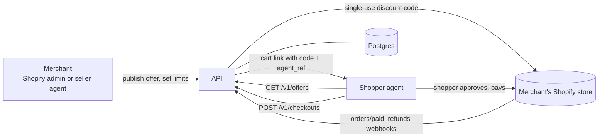

# Offerlayer

Offerlayer lets a Shopify store offer a price that AI shopping agents can find
and apply. The merchant sets the discount, the eligible products, and a budget.
An agent that finds the offer creates a single-use checkout, shows the shopper
the discount before payment, and hands over a cart with the discount already
on it. Every order is attributed back to the agent that brought it.

"Agent-only" is a channel incentive, not a secret: anyone shopping through an
agent can get the price. What Offerlayer guarantees is that codes are
single-use, tied to one cart, short-lived, budget-capped, and never published
as a reusable coupon.

## How it fits together



| Piece | Where | What it does |
| --- | --- | --- |
| API | `apps/api` | Hono app: offers, checkouts, seller routes, Shopify OAuth and webhooks, scheduled jobs |
| Web | `src/` | Site and docs (TanStack Start). In production, Nitro serves the site and mounts the API (`server/middleware/offerlayer-api.ts`) in one Vercel function |
| MCP server | `apps/mcp` | Shopper or seller tools over MCP (stdio today) |
| Shopify app | `apps/shopify` | Prototype install page; replaced by the embedded app in Phase 2 |
| Packages | `packages/schema`, `packages/token`, `packages/db` | Offer schema and money math, signed checkout tokens, database schema, config, and migrations |
| Protocol | `protocol/` | `openapi.yaml`, `offer.schema.json`, and the integration guide |

## Run it locally

Requirements: Node 22 and pnpm 10 (`corepack enable`).

```bash
pnpm install
cp .env.example .env
# set OFFERLAYER_DEMO=1 in .env: public demo keys, an embedded database, demo data
pnpm api        # API on http://127.0.0.1:8787
pnpm dev        # site on http://127.0.0.1:8080, proxying API paths to :8787
```

Demo mode uses PGlite, an embedded Postgres, stored in `./data/pglite`. Set
`DATABASE_URL=memory:` for a throwaway database, or a `postgres://` URL to use
a real one.

End-to-end demos, each with its own in-memory database:

```bash
pnpm demo            # shopper: search, checkout, simulated purchase, hold cleared
pnpm demo:seller     # seller: connect a shop, publish an offer
pnpm demo:mandate    # seller limits (mandates)
pnpm demo:shopify    # Shopify OAuth and catalog against a fake shop
pnpm demo:agentic    # checkout handoff for agentic checkout
```

MCP over stdio:

```bash
OFFERLAYER_URL=http://127.0.0.1:8787 OFFERLAYER_AGENT_KEY=agt_live_… pnpm mcp
```

## Configuration

Every variable is listed with a one-line description in `.env.example`, and
typed and validated in `packages/db/src/env.ts`. A test fails if the two drift
apart.

Production (no `OFFERLAYER_DEMO`) refuses to boot without a `postgres://`
`DATABASE_URL`, the three crypto secrets, the internal key, and the two
bootstrap agent keys. See `docs/SECRETS.md` for each secret and how to rotate it.

## Tests and checks

```bash
pnpm typecheck
pnpm lint
pnpm test                                   # on PGlite
TEST_DATABASE_URL=postgres://… pnpm test    # same suite on a real (throwaway) Postgres
```

CI (`.github/workflows/ci.yml`) runs the above on every pull request, plus the
suite against Postgres 16, and boots the production build to check that no
demo route is reachable (`pnpm check:prod-boot`).

## Deploy

Vercel, from the repo root. `pnpm build` builds the site and API function,
then runs `pnpm db:migrate`.

1. Create a Supabase project and set `DATABASE_URL` (transaction pooler) and
   `DATABASE_URL_DIRECT` (direct connection). See `docs/DATABASE.md`.
2. Set the production secrets from `.env.example`.
3. Point the domains at the deployment:
   `www.offerlayer.io` (site), `api.offerlayer.io` (API and webhooks), and
   `mcp.offerlayer.io` (MCP, once the remote server ships).
4. Set `CRON_SECRET`. Vercel Cron runs the daily discount-code cleanup
   (`vercel.json`).

Any deployed host needs Postgres, even in demo mode: the bundled server
cannot run the embedded database.

## Docs

- `protocol/CONNECTOR.md`: integration guide for agent developers
- `protocol/openapi.yaml`: API contract
- `docs/DATABASE.md`: Postgres, Supabase, migrations, RLS
- `docs/SECRETS.md`: secrets and rotation
- `docs/SHOPIFY.md`: Shopify Partner app setup
- `docs/ACCEPTANCE.md`: what must be true before a release
- `docs/integrations/`: notes for specific agent platforms
- `archive/`: superseded prototype briefs, kept for history

## Conventions

- Money and percentages are decimal strings (`"32.00"`), never floats.
- Every public offer carries a `disclosure` that agents must show before payment.
- A key has one role: shopper (`agt_live_…`) or seller (`agt_sell_…`).
- Never commit secrets or print real keys in docs, UI, or logs.
